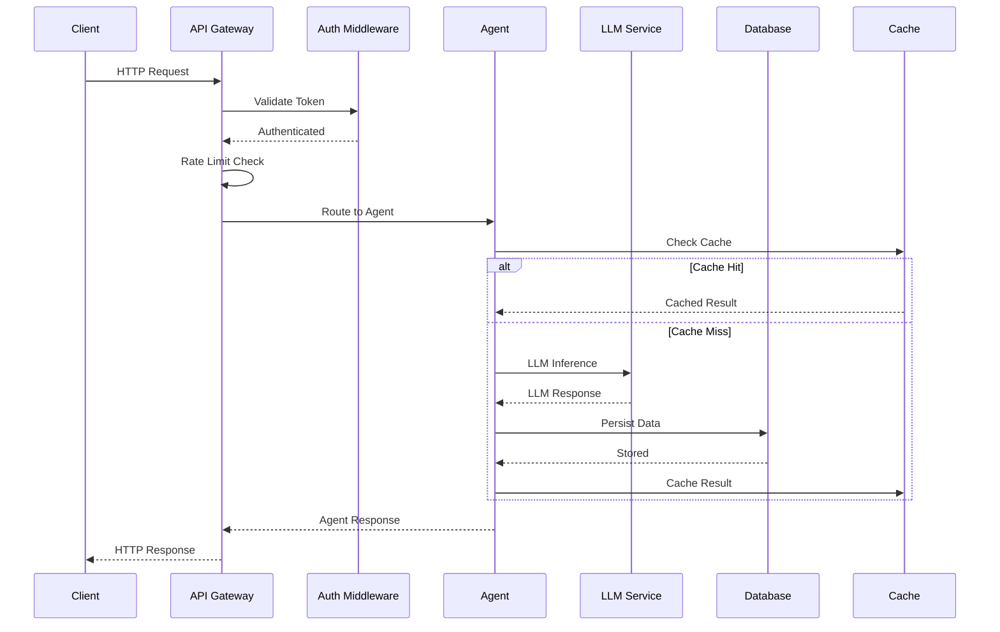
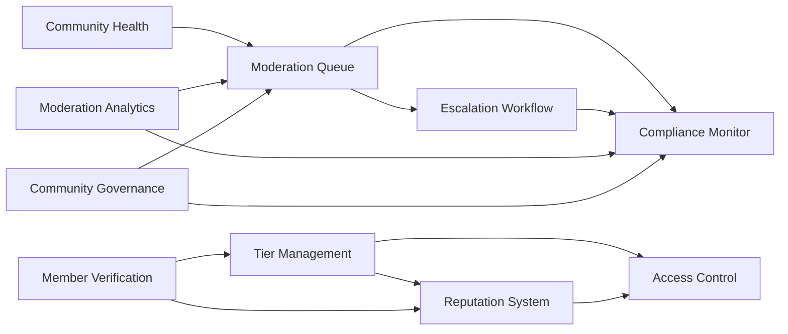
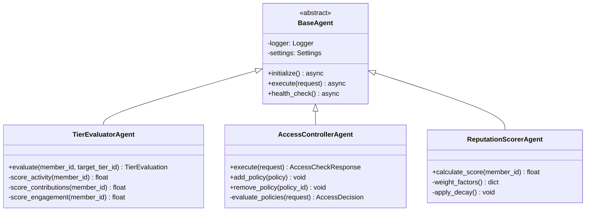
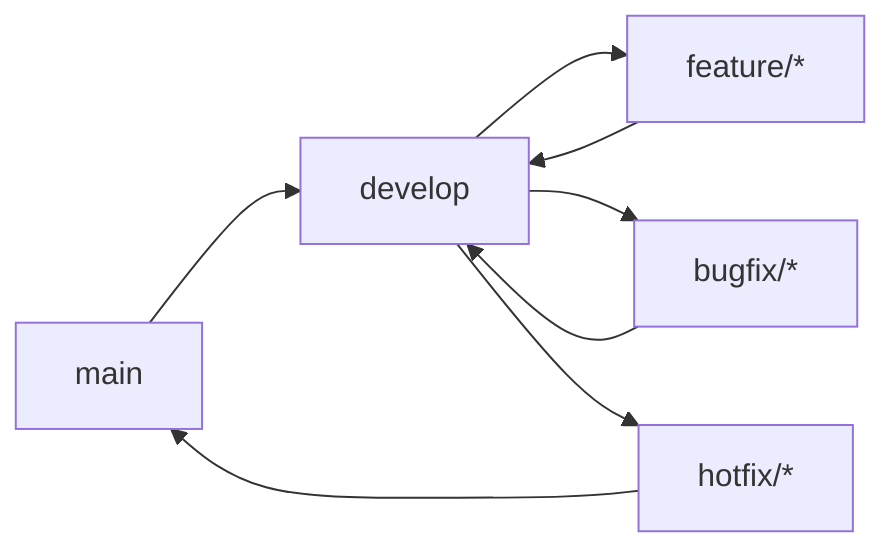

# Gated Communities — Unified Platform

[](https://github.com/ahmedhassan/gated-communities/actions)
[](https://www.python.org/downloads/)
[](https://fastapi.tiangolo.com/)
[](LICENSE)
[](https://www.docker.com/)
[](https://kubernetes.io/)
[](https://docs.astral.sh/ruff/)
[](https://mypy.readthedocs.io/)

> A production-grade, modular gated community management platform consolidating 10 independent services into a single standalone application with 57 AI-powered agents.

---

## Table of Contents

- [Overview](#overview)
- [Architecture](#architecture)
- [Features](#features)
- [Quick Start](#quick-start)
- [API Reference](#api-reference)
- [Deployment](#deployment)
- [Development](#development)
- [Contributing](#contributing)
- [Changelog](#changelog)
- [License](#license)

---

## Overview

Gated Communities is a unified platform for managing gated online communities. It consolidates 10 independent domain services — Tier Management, Moderation Queue, Access Control, Community Health, Member Verification, Escalation Workflow, Reputation System, Compliance Monitor, Moderation Analytics, and Community Governance — into a single, cohesive FastAPI application powered by 57 specialized AI agents.

### Why Gated Communities?

| Challenge | Solution |
|-----------|----------|
| Fragmented tooling across 10 services | Unified API with consistent interfaces |
| Manual moderation at scale | AI-powered auto-moderation with human-in-the-loop |
| Inconsistent access policies | Centralized policy engine with tier-based gating |
| No reputation tracking | Multi-factor reputation scoring with decay |
| Compliance blind spots | Real-time violation detection and audit trails |
| Slow dispute resolution | Automated escalation workflow with SLA tracking |

---

## Architecture

### High-Level Architecture

```mermaid
graph TB
    subgraph "Client Layer"
        Web[Web App<br/>Next.js]
        Mobile[Mobile App]
        Admin[Admin Panel]
        API[API Clients]
    end

    subgraph "API Gateway Layer"
        GW[FastAPI Gateway]
        Auth[Auth Middleware]
        RateLimit[Rate Limiter]
        CORS[CORS Middleware]
    end

    subgraph "Agent Services Layer"
        direction TB
        subgraph "Tier Management"
            TE[Tier Evaluator]
            TA[Tier Analytics]
            TR[Upgrade Recommender]
            BM[Benefit Manager]
            AC[Access Controller]
        end
        subgraph "Moderation Queue"
            AM[Auto Moderator]
            QO[Queue Optimizer]
            HR[Human Review Router]
            PS[Priority Scorer]
            ESC[Escalation]
        end
        subgraph "Access Control"
            PE[Permission Evaluator]
            RM[Role Manager]
            AE[Access Auditor]
            AR[Access Recommender]
            PE2[Policy Enforcer]
        end
        subgraph "Community Health"
            TD[Toxicity Detector]
            EM[Engagement Metrics]
        end
        subgraph "Member Verification"
            IV[Identity Verifier]
            DC[Document Checker]
            FP[Fraud Preventor]
            TS[Trust Scorer]
            EX[Explainer]
        end
        subgraph "Escalation Workflow"
            AR2[Auto Resolver]
            SO[Resolution Optimizer]
            ST[SLA Tracker]
            EA[Escalation Analyzer]
            PR[Priority Router]
        end
        subgraph "Reputation System"
            RS[Reputation Scorer]
            BT[Trust Tier]
            BM2[Badge Manager]
            RH[Reputation History]
            RE[Reputation Explainer]
        end
        subgraph "Compliance Monitor"
            PT[Policy Tracker]
            AR3[Audit Reporter]
            CS[Compliance Scorer]
            VD[Violation Detector]
            REM[Remediation]
        end
        subgraph "Moderation Analytics"
            MP[Moderation Predictor]
            MPerf[Moderator Performance]
            PE3[Policy Effectiveness]
            AE2[Analytics Explainer]
            TA2[Trend Analyzer]
        end
        subgraph "Community Governance"
            DR[Dispute Resolver]
            GA[Governance Analytics]
            RE2[Rule Enforcer]
            PM[Policy Manager]
            GE[Governance Explainer]
        end
    end

    subgraph "Integration Layer"
        LLM[LLM Service<br/>LangChain]
        DB[(PostgreSQL)]
        Cache[(Redis)]
        Notif[Notifications<br/>Slack/Email]
        Ext[External APIs]
        Storage[File Storage]
    end

    subgraph "Infrastructure Layer"
        K8s[Kubernetes]
        CI[CI/CD Pipeline]
        Mon[Monitoring<br/>Prometheus]
        Log[Logging<br/>structlog]
    end

    Web & Mobile & Admin & API --> GW
    GW --> Auth --> RateLimit --> CORS
    CORS --> Agent Services Layer
    Agent Services Layer --> Integration Layer
    Agent Services Layer --> Infrastructure Layer
```

### Data Flow



### Module Dependencies



### Agent Architecture



---

## Features

### Tier Management

Member tier evaluation, benefits management, and upgrade recommendations.

- **Tier Evaluator** — Automatically evaluates members against tier criteria
- **Tier Analytics** — Tracks tier distribution, conversion rates, and churn
- **Upgrade Recommender** — Suggests optimal upgrade paths for members
- **Benefit Manager** — Manages tier-specific benefits and entitlements
- **Access Controller** — Gates resources based on tier membership

> **Screenshot Description:** *Tiers list page showing a table with columns: Tier Name, Level (with colored badges — Bronze, Silver, Gold, Platinum, Diamond), Status, Members Count, Monthly Fee, and Actions (Edit, Delete). A "Create Tier" button is in the top-right corner.*

### Moderation Queue

AI-powered auto-moderation with human-in-the-loop review.

- **Auto Moderator** — Flags content based on toxicity, spam, and prohibited content
- **Queue Optimizer** — Prioritizes items by severity and age
- **Human Review Router** — Routes complex cases to human moderators
- **Priority Scorer** — Assigns priority scores to queue items
- **Escalation** — Auto-escalates critical items to senior staff

> **Screenshot Description:** *Moderation queue page with filter bar (Status, Priority), table with content preview and AI analysis, and bulk actions bar (Approve, Reject, Escalate).*

### Access Control

Fine-grained permission evaluation and policy management.

- **Permission Evaluator** — Evaluates access requests against policies
- **Role Manager** — Manages role definitions and assignments
- **Access Auditor** — Logs all access decisions for compliance
- **Access Recommender** — Suggests policy improvements
- **Policy Enforcer** — Enforces access policies in real-time

> **Screenshot Description:** *Access checker page with input fields (Member ID, Resource, Action), "Check Access" button, and result panel showing Decision (Allowed/Denied), Reason, Matching Policy, and Member's Tier.*

### Community Health Scorer

Real-time community health monitoring and toxicity detection.

- **Toxicity Detector** — ML-based toxicity scoring for content
- **Engagement Metrics** — Tracks participation and activity levels

> **Screenshot Description:** *Health analytics page with health score trend line chart, toxicity level gauge, engagement rate chart, and activity heatmap by hour and day.*

### Member Verification

Identity verification, fraud prevention, and trust scoring.

- **Identity Verifier** — Verifies member identity documents
- **Document Checker** — Validates document authenticity
- **Fraud Preventor** — Detects fraudulent verification attempts
- **Trust Scorer** — Assigns trust scores based on verification
- **Explainer** — Provides transparency in verification decisions

> **Screenshot Description:** *Verification dashboard with stats row (Pending, Verified, Rejected, Avg Confidence), table with member details, and review page with document preview and AI analysis panel.*

### Escalation Workflow

Automated escalation resolution with SLA tracking.

- **Auto Resolver** — Attempts automatic resolution of escalations
- **Resolution Optimizer** — Optimizes resolution strategies
- **SLA Tracker** — Tracks SLA compliance for escalations
- **Escalation Analyzer** — Analyzes escalation patterns
- **Priority Router** — Routes escalations to appropriate staff

> **Screenshot Description:** *Escalations page with stats (Open, In Review, Resolved, Avg Resolution Time), escalations table with priority badges, and detail view with conversation thread and resolution options.*

### Reputation System

Multi-factor reputation scoring with badges and trust tiers.

- **Reputation Scorer** — Calculates weighted reputation scores
- **Trust Tier** — Assigns trust tiers based on reputation
- **Badge Manager** — Manages achievement badges
- **Reputation History** — Tracks reputation changes over time
- **Reputation Explainer** — Explains reputation score factors

> **Screenshot Description:** *Reputation page with member search bar, reputation score gauge (0-100) with color coding, trust tier badge, badges earned as icons, and reputation history table.*

### Compliance Monitor

Policy tracking, violation detection, and audit trails.

- **Policy Tracker** — Tracks compliance policies and changes
- **Audit Reporter** — Generates compliance audit reports
- **Compliance Scorer** — Scores community compliance level
- **Violation Detector** — Detects policy violations in real-time
- **Remediation** — Suggests remediation actions for violations

> **Screenshot Description:** *Compliance dashboard with compliance score gauge, active policies count, recent violations table, and audit log section with filterable entries.*

### Moderation Analytics

Trend analysis, prediction, and performance metrics.

- **Moderation Predictor** — Predicts moderation load trends
- **Moderator Performance** — Tracks moderator accuracy and speed
- **Policy Effectiveness** — Measures policy effectiveness over time
- **Analytics Explainer** — Explains analytics insights
- **Trend Analyzer** — Identifies emerging trends

> **Screenshot Description:** *Moderation analytics page with date range selector, key metrics cards, line chart (items over time), bar chart (top violations), and moderator performance table.*

### Community Governance

Dispute resolution, rule enforcement, and policy management.

- **Dispute Resolver** — Facilitates dispute resolution
- **Governance Analytics** — Tracks governance metrics
- **Rule Enforcer** — Enforces community rules
- **Policy Manager** — Manages governance policies
- **Governance Explainer** — Explains governance decisions

> **Screenshot Description:** *Disputes page with stats (Open, Resolved, Avg Resolution Time), disputes table, and resolution page with conversation thread, evidence, and resolution options.*

---

## Quick Start

### Prerequisites

| Software | Version | Purpose |
|----------|---------|---------|
| Python | 3.10+ | Runtime |
| Docker | 24.0+ | Container runtime |
| Docker Compose | 2.0+ | Multi-container orchestration |
| PostgreSQL | 15+ | Primary database |
| Redis | 7+ | Cache and session store |

### Docker Compose (Recommended)

```bash
# Clone the repository
git clone https://github.com/ahmedhassan/gated-communities.git
cd gated-communities

# Copy environment file
cp .env.example .env

# Start all services
docker-compose up -d

# View logs
docker-compose logs -f app
```

The API will be available at `http://localhost:8000`.

### Local Development

```bash
# Create virtual environment
python -m venv .venv
source .venv/bin/activate

# Install dependencies
pip install -e ".[dev]"

# Set up environment variables
cp .env.example .env
# Edit .env with your values

# Start database and cache
docker-compose up -d db redis

# Run the application
uvicorn gated_communities.main:app --reload
```

### Verify Installation

```bash
# Health check
curl http://localhost:8000/health

# Expected response:
# {"status":"healthy","version":"1.0.0","service":"gated-communities"}

# API documentation
open http://localhost:8000/docs
```

### Kubernetes

```bash
# Using kubectl
kubectl apply -f k8s/

# Using Helm
helm install gated-communities ./helm/
```

---

## API Reference

**Base URL:** `http://localhost:8000/api/v1`

### Interactive Documentation

| Endpoint | Description |
|----------|-------------|
| `/docs` | Swagger UI |
| `/redoc` | ReDoc |
| `/openapi.json` | OpenAPI Schema |

### Core Endpoints

#### Health

| Method | Endpoint | Description |
|--------|----------|-------------|
| GET | `/health` | Health check |
| GET | `/ready` | Readiness probe |
| GET | `/live` | Liveness probe |

#### Tiers

| Method | Endpoint | Description |
|--------|----------|-------------|
| GET | `/tiers` | List all tiers |
| POST | `/tiers` | Create a new tier |
| GET | `/tiers/{tier_id}` | Get a specific tier |
| PUT | `/tiers/{tier_id}` | Update a tier |
| DELETE | `/tiers/{tier_id}` | Delete a tier |

#### Access Control

| Method | Endpoint | Description |
|--------|----------|-------------|
| POST | `/access/check` | Check member access |
| POST | `/access/policies` | Create access policy |
| GET | `/access/policies` | List access policies |
| GET | `/access/policies/{policy_id}` | Get a specific policy |
| DELETE | `/access/policies/{policy_id}` | Delete a policy |

#### Moderation

| Method | Endpoint | Description |
|--------|----------|-------------|
| GET | `/moderation/queue` | Get moderation queue items |

#### Reputation

| Method | Endpoint | Description |
|--------|----------|-------------|
| GET | `/reputation` | Get reputation scores |

#### Compliance

| Method | Endpoint | Description |
|--------|----------|-------------|
| GET | `/compliance/policies` | List compliance policies |

#### Analytics

| Method | Endpoint | Description |
|--------|----------|-------------|
| GET | `/analytics/moderation` | Get moderation analytics |

#### Governance

| Method | Endpoint | Description |
|--------|----------|-------------|
| GET | `/governance/disputes` | List disputes |

#### Verification

| Method | Endpoint | Description |
|--------|----------|-------------|
| POST | `/verification/verify` | Verify member identity |

#### Escalations

| Method | Endpoint | Description |
|--------|----------|-------------|
| GET | `/escalations` | List escalations |
| POST | `/escalations` | Create escalation |

#### Metrics

| Method | Endpoint | Description |
|--------|----------|-------------|
| GET | `/metrics` | Prometheus metrics |

### Example: Create a Tier

```bash
curl -X POST http://localhost:8000/api/v1/tiers \
  -H "Content-Type: application/json" \
  -d '{
    "name": "Platinum",
    "level": "platinum",
    "description": "Premium platinum membership",
    "requirements": {
      "min_activity_score": 90,
      "min_tenure_days": 90
    },
    "benefits": ["priority_support", "exclusive_access", "bonus_credits"],
    "max_members": 500,
    "monthly_fee": 99.99
  }'
```

### Example: Check Access

```bash
curl -X POST http://localhost:8000/api/v1/access/check \
  -H "Content-Type: application/json" \
  -d '{
    "member_id": "550e8400-e29b-41d4-a716-446655440000",
    "resource": "premium_forum",
    "action": "read",
    "context": {
      "ip_address": "192.168.1.1",
      "user_agent": "Mozilla/5.0"
    }
  }'
```

### Error Handling

All errors follow a consistent format:

```json
{
  "detail": "Human-readable error message"
}
```

| Code | Description |
|------|-------------|
| 200 | Success |
| 201 | Created |
| 204 | No content |
| 400 | Bad request |
| 401 | Unauthorized |
| 403 | Forbidden |
| 404 | Not found |
| 422 | Validation error |
| 429 | Rate limited |
| 500 | Internal server error |

---

## Deployment

### Docker Compose (Development)

```bash
# Start all services
docker-compose up -d

# View logs
docker-compose logs -f app

# Stop all services
docker-compose down
```

### Docker Compose (Production)

```bash
# Use production compose file
docker-compose -f docker/docker-compose.prod.yml up -d

# With custom environment
docker-compose -f docker/docker-compose.prod.yml --env-file .env.prod up -d
```

### Kubernetes

```bash
# 1. Create namespace
kubectl apply -f k8s/namespace.yaml

# 2. Create secrets (edit with real values first!)
kubectl apply -f k8s/secret.yaml

# 3. Create configmap
kubectl apply -f k8s/configmap.yaml

# 4. Create service
kubectl apply -f k8s/service.yaml

# 5. Create deployment
kubectl apply -f k8s/deployment.yaml

# 6. Create ingress
kubectl apply -f k8s/ingress.yaml

# 7. Create HPA
kubectl apply -f k8s/hpa.yaml

# 8. Create PDB
kubectl apply -f k8s/pdb.yaml
```

### Helm

```bash
# Install with default values
helm install gated-communities ./helm/

# Install with custom values
helm install gated-communities ./helm/ -f custom-values.yaml

# Upgrade
helm upgrade gated-communities ./helm/

# Uninstall
helm uninstall gated-communities
```

### Environment Variables

| Variable | Default | Description |
|----------|---------|-------------|
| `DATABASE_URL` | — | PostgreSQL connection string |
| `REDIS_URL` | — | Redis connection string |
| `LLM_API_KEY` | — | OpenAI API key |
| `SECRET_KEY` | — | Application secret key |
| `LOG_LEVEL` | `INFO` | Logging level |
| `ENVIRONMENT` | `production` | Deployment environment |
| `DEBUG` | `false` | Debug mode |
| `CORS_ORIGINS` | `["*"]` | Allowed CORS origins |
| `DATABASE_POOL_SIZE` | `20` | Database connection pool size |
| `MODERATION_THRESHOLD` | `0.8` | Auto-moderation threshold |
| `ESCALATION_TIMEOUT_MINUTES` | `30` | Escalation timeout |
| `REPUTATION_DECAY_DAYS` | `90` | Reputation decay period |
| `COMPLIANCE_AUDIT_RETENTION_DAYS` | `365` | Audit log retention |
| `METRICS_ENABLED` | `true` | Enable Prometheus metrics |
| `TRACING_ENABLED` | `false` | Enable distributed tracing |

### Health Checks

| Endpoint | Purpose | Expected Response |
|----------|---------|-------------------|
| `GET /health` | Overall health | `{"status": "healthy", ...}` |
| `GET /ready` | Readiness probe | `{"ready": true, ...}` |
| `GET /live` | Liveness probe | `{"alive": true}` |

### Monitoring

Prometheus metrics are available at `GET /metrics`:

```
# TYPE http_requests_total counter
http_requests_total{method="GET",endpoint="/health"} 1523

# TYPE http_request_duration_seconds gauge
http_request_duration_seconds{endpoint="/api/v1/tiers"} 0.045

# TYPE agent_executions_total counter
agent_executions_total{agent="TierEvaluatorAgent"} 456
```

### Backup and Recovery

```bash
# Database backup
docker-compose exec db pg_dump -U postgres gated_communities > backup.sql

# Database restore
docker-compose exec -T db psql -U postgres gated_communities < backup.sql

# Redis backup
docker-compose exec redis redis-cli SAVE
docker cp gated-communities_redis_1:/data/dump.rdb ./dump.rdb
```

---

## Development

### Project Setup

```bash
# Clone the repository
git clone https://github.com/ahmedhassan/gated-communities.git
cd gated-communities

# Create virtual environment
python -m venv .venv
source .venv/bin/activate

# Install dependencies
pip install -e ".[dev,test]"

# Set up environment variables
cp .env.example .env

# Run database and cache
docker-compose up -d db redis

# Start the development server
uvicorn gated_communities.main:app --reload
```

### Project Structure

```
gated-communities/
├── src/gated_communities/
│   ├── agents/                    # 57 AI agents across 10 modules
│   │   ├── access_control/        # Access control agents
│   │   ├── community_governance/  # Governance agents
│   │   ├── community_health_scorer/
│   │   ├── compliance_monitor/
│   │   ├── escalation_workflow/
│   │   ├── member_verification/
│   │   ├── moderation_analytics/
│   │   ├── moderation_queue/
│   │   ├── reputation_system/
│   │   └── tier_management/
│   ├── api/                       # FastAPI routes
│   │   ├── routes.py             # Main router
│   │   ├── health.py             # Health endpoints
│   │   ├── tiers.py              # Tier endpoints
│   │   ├── access.py             # Access control endpoints
│   │   └── ...
│   ├── integrations/              # External integrations
│   │   ├── database.py           # Database client
│   │   ├── cache.py              # Cache client
│   │   ├── llm.py                # LLM client
│   │   └── notifications.py      # Notification service
│   ├── config/                    # Configuration
│   │   ├── settings.py           # App settings
│   │   └── logging_config.py     # Logging config
│   ├── models/                    # Pydantic schemas
│   ├── exceptions.py              # Custom exceptions
│   └── tests/                     # Test suite
├── k8s/                           # Kubernetes manifests
├── helm/                          # Helm chart
├── docker/                        # Docker compose files
├── .github/workflows/             # CI/CD pipeline
├── Dockerfile
├── docker-compose.yml
├── pyproject.toml
└── README.md
```

### Testing

```bash
# Run all tests
pytest

# Run with coverage
pytest --cov=src/gated_communities --cov-report=html

# Run specific test file
pytest src/gated_communities/tests/test_api.py

# Run specific test
pytest src/gated_communities/tests/test_api.py::test_health_check
```

### Linting and Type Checking

```bash
# Lint with Ruff
ruff check src/

# Auto-fix linting issues
ruff check src/ --fix

# Type check with MyPy
mypy src/

# Run pre-commit hooks
pre-commit run --all-files
```

### Adding a New Agent

```python
# src/gated_communities/agents/my_module/my_agent.py
from __future__ import annotations
from typing import Any
from .base import BaseAgent

class MyAgent(BaseAgent):
    """Agent that performs a specific task."""

    async def initialize(self) -> None:
        """Initialize the agent."""
        self.logger.info("MyAgent initialized")

    async def execute(self, request: dict[str, Any]) -> dict[str, Any]:
        """Execute the agent's main logic."""
        result = {
            "status": "success",
            "data": {},
        }
        return result

    async def health_check(self) -> bool:
        """Check if the agent is healthy."""
        return True
```

### Adding a New API Endpoint

```python
# src/gated_communities/api/my_module.py
from __future__ import annotations
from fastapi import APIRouter, Depends
from tier_management.config.settings import Settings, get_settings

my_router = APIRouter()

@my_router.get("/my-endpoint", response_model=dict)
async def my_endpoint(
    settings: Settings = Depends(get_settings),
) -> dict:
    """My endpoint description."""
    return {"message": "Hello, World!"}
```

### Commit Message Format

```
<type>: <description>

[optional body]

[optional footer]
```

| Type | Description |
|------|-------------|
| `feat` | New feature |
| `fix` | Bug fix |
| `docs` | Documentation changes |
| `style` | Code style changes |
| `refactor` | Code refactoring |
| `test` | Test changes |
| `chore` | Build/tooling changes |

### Branching Strategy



---

## Contributing

We welcome contributions! Please follow these guidelines:

### Getting Started

1. **Fork** the repository
2. **Clone** your fork
3. **Create** a feature branch (`git checkout -b feature/my-feature`)
4. **Make** your changes
5. **Run** tests and linting
6. **Commit** your changes
7. **Push** to your fork
8. **Open** a Pull Request

### Pull Request Checklist

- [ ] Tests pass (`pytest`)
- [ ] Linting passes (`ruff check src/`)
- [ ] Type checking passes (`mypy src/`)
- [ ] Documentation updated
- [ ] Commit messages follow convention
- [ ] No merge conflicts

### Code Review Process

1. PR is opened
2. Automated checks run (CI/CD)
3. Code review by maintainer
4. Approved and merged

### Release Process

1. Update version in `pyproject.toml`
2. Update `CHANGELOG.md`
3. Create git tag (`git tag v1.0.0`)
4. Push tag (`git push origin v1.0.0`)
5. CI/CD builds and deploys

---

## Changelog

All notable changes to this project will be documented in this file.

The format is based on [Keep a Changelog](https://keepachangelog.com/en/1.0.0/),
and this project adheres to [Semantic Versioning](https://semver.org/spec/v2.0.0.html).

### [1.0.0] - 2024-01-15

#### Added
- Initial release of Gated Communities platform
- 10 domain modules with 57 AI-powered agents
- FastAPI-based REST API with OpenAPI documentation
- Docker Compose development environment
- Kubernetes deployment manifests
- Helm chart for Kubernetes deployments
- CI/CD pipeline with GitHub Actions
- Prometheus metrics and monitoring
- Structured logging with structlog
- Comprehensive test suite with pytest
- Pre-commit hooks with Ruff and MyPy

#### Security
- JWT-based authentication
- Role-based access control (RBAC)
- Policy-based access control (PBAC)
- Rate limiting per client
- Input validation via Pydantic
- Secrets stored in Kubernetes Secrets

---

## License

This project is licensed under the MIT License — see the [LICENSE](LICENSE) file for details.

```
MIT License

Copyright (c) 2024 Ahmed Hassan

Permission is hereby granted, free of charge, to any person obtaining a copy
of this software and associated documentation files (the "Software"), to deal
in the Software without restriction, including without limitation the rights
to use, copy, modify, merge, publish, distribute, sublicense, and/or sell
copies of the Software, and to permit persons to whom the Software is
furnished to do so, subject to the following conditions:

The above copyright notice and this permission notice shall be included in all
copies or substantial portions of the Software.

THE SOFTWARE IS PROVIDED "AS IS", WITHOUT WARRANTY OF ANY KIND, EXPRESS OR
IMPLIED, INCLUDING BUT NOT LIMITED TO THE WARRANTIES OF MERCHANTABILITY,
FITNESS FOR A PARTICULAR PURPOSE AND NONINFRINGEMENT. IN NO EVENT SHALL THE
AUTHORS OR COPYRIGHT HOLDERS BE LIABLE FOR ANY CLAIM, DAMAGES OR OTHER
LIABILITY, WHETHER IN AN ACTION OF CONTRACT, TORT OR OTHERWISE, ARISING FROM,
OUT OF OR IN CONNECTION WITH THE SOFTWARE OR THE USE OR OTHER DEALINGS IN THE
SOFTWARE.
```

---

<div align="center">

**[Back to Top](#gated-communities--unified-platform)**

Made with ❤️ by [Ahmed Hassan](https://github.com/ahmedhassan)

</div>
