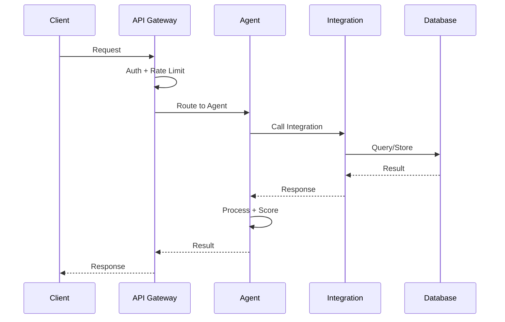
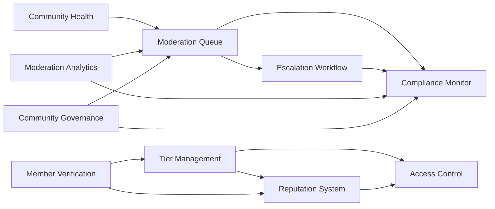

# Gated Communities Architecture

## System Overview

```mermaid
graph TB
    subgraph "Client Layer"
        Web[Web App]
        Mobile[Mobile App]
        Admin[Admin Panel]
    end

    subgraph "API Gateway"
        GW[FastAPI Gateway]
        Auth[Auth Middleware]
        RateLimit[Rate Limiter]
    end

    subgraph "Agent Services"
        direction TB
        subgraph "Tier Management"
            TE[Tier Evaluator]
            TA[Tier Analytics]
            TR[Upgrade Recommender]
            BM[Benefit Manager]
            AC[Access Controller]
        end
        subgraph "Moderation Queue"
            AM[Auto Moderator]
            QO[Queue Optimizer]
            HR[Human Review Router]
            PS[Priority Scorer]
            ESC[Escalation]
        end
        subgraph "Access Control"
            PE[Permission Evaluator]
            RM[Role Manager]
            AE[Access Auditor]
            AR[Access Recommender]
            PE2[Policy Enforcer]
        end
        subgraph "Community Health"
            TD[Toxicity Detector]
            EM[Engagement Metrics]
        end
        subgraph "Member Verification"
            IV[Identity Verifier]
            DC[Document_checker]
            FP[Fraud Preventor]
            TS[Trust Scorer]
            EX[Explainer]
        end
        subgraph "Escalation Workflow"
            AR2[Auto Resolver]
            SO[Resolution Optimizer]
            ST[SLA Tracker]
            EA[Escalation Analyzer]
            PR[Priority Router]
        end
        subgraph "Reputation System"
            RS[Reputation Scorer]
            BT[Trust Tier]
            BM2[Badge Manager]
            RH[Reputation History]
            RE[Reputation Explainer]
        end
        subgraph "Compliance Monitor"
            PT[Policy Tracker]
            AR3[Audit Reporter]
            CS[Compliance Scorer]
            VD[Violation Detector]
            REM[Remediation]
        end
        subgraph "Moderation Analytics"
            MP[Moderation Predictor]
            MPerf[Moderator Performance]
            PE3[Policy Effectiveness]
            AE2[Analytics Explainer]
            TA2[Trend Analyzer]
        end
        subgraph "Community Governance"
            DR[Dispute Resolver]
            GA[Governance Analytics]
            RE2[Rule Enforcer]
            PM[Policy Manager]
            GE[Governance Explainer]
        end
    end

    subgraph "Integration Layer"
        LLM[LLM Service]
        DB[(PostgreSQL)]
        Cache[(Redis)]
        Notif[Notifications]
        Ext[External APIs]
    end

    subgraph "Infrastructure"
        K8s[Kubernetes]
        CI[CI/CD Pipeline]
        Mon[Monitoring]
        Log[Logging]
    end

    Web & Mobile & Admin --> GW
    GW --> Auth --> RateLimit
    RateLimit --> Agent Services
    Agent Services --> Integration Layer
    Agent Services --> Infrastructure
```

## Data Flow



## Module Dependencies


