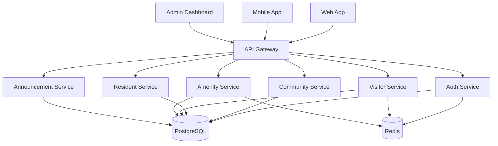

# Gated Communities

A production-grade platform for managing gated communities — access control, resident management, visitor passes, amenity booking, and announcements.

## Architecture



## Features

- **Access Control** — Gate entry/exit logging, QR-based passes, vehicle tracking
- **Resident Management** — Unit assignment, household profiles, move-in/move-out
- **Visitor Management** — Pre-registration, OTP verification, visit history
- **Amenity Booking** — Clubhouse, gym, pool, tennis court reservations
- **Announcements** — Community-wide and building-level notifications
- **Security** — Role-based access, audit logging, rate limiting
- **Reporting** — Occupancy, visitor traffic, amenity utilization

## Quick Start

### Prerequisites

- Node.js 20+
- PostgreSQL 15+
- Redis 7+
- Docker (optional)

### Local Development

```bash
# Clone the repository
git clone https://github.com/your-org/gated-communities.git
cd gated-communities

# Install dependencies
npm install

# Set up environment variables
cp .env.example .env
# Edit .env with your database and Redis credentials

# Run database migrations
npm run migrate

# Seed development data
npm run seed

# Start development server
npm run dev
```

The API will be available at `http://localhost:3000`.

### Docker

```bash
# Build and start all services
docker-compose up -d

# Run migrations
docker-compose exec api npm run migrate

# View logs
docker-compose logs -f api
```

## Environment Variables

| Variable | Description | Default |
|----------|-------------|---------|
| `PORT` | API server port | `3000` |
| `DATABASE_URL` | PostgreSQL connection string | — |
| `REDIS_URL` | Redis connection string | — |
| `JWT_SECRET` | Secret for JWT signing | — |
| `JWT_EXPIRY` | Token expiry duration | `24h` |
| `BCRYPT_ROUNDS` | Password hashing rounds | `12` |
| `RATE_LIMIT_WINDOW` | Rate limit window (ms) | `900000` |
| `RATE_LIMIT_MAX` | Max requests per window | `100` |
| `CORS_ORIGIN` | Allowed CORS origins | `*` |
| `LOG_LEVEL` | Logging level | `info` |

## Project Structure

```
gated-communities/
├── src/
│   ├── config/          # Configuration management
│   ├── middleware/      # Express middleware
│   ├── models/          # Database models
│   ├── routes/          # API route definitions
│   ├── services/        # Business logic
│   ├── utils/           # Utility functions
│   └── app.js           # Application entry point
├── tests/               # Test suites
├── migrations/          # Database migrations
├── seeds/               # Seed data
├── docker/              # Docker configurations
├── k8s/                 # Kubernetes manifests
├── terraform/           # Terraform configurations
└── docs/                # Documentation
```

## API Documentation

See [API.md](./API.md) for the complete API reference.

## Deployment

See [DEPLOYMENT.md](./DEPLOYMENT.md) for deployment guides.

## Contributing

1. Fork the repository
2. Create a feature branch (`git checkout -b feature/amazing-feature`)
3. Commit your changes (`git commit -m 'Add amazing feature'`)
4. Push to the branch (`git push origin feature/amazing-feature`)
5. Open a Pull Request

## License

MIT
