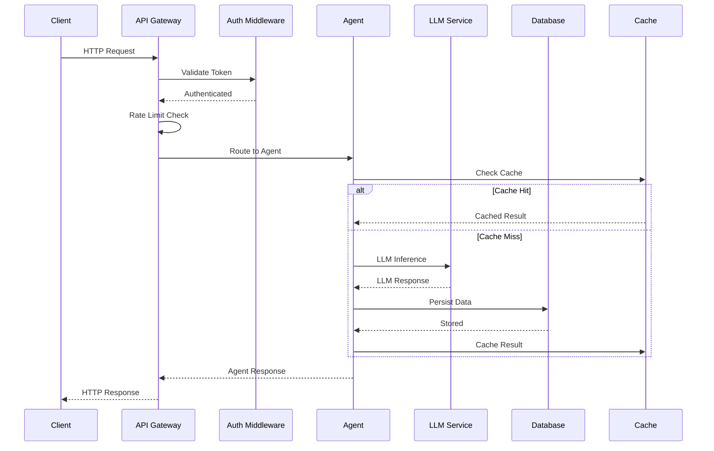
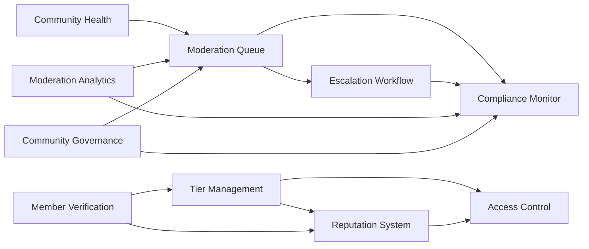
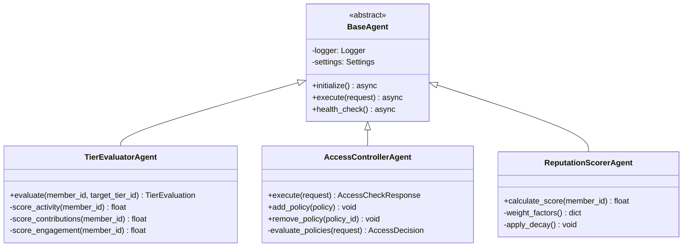
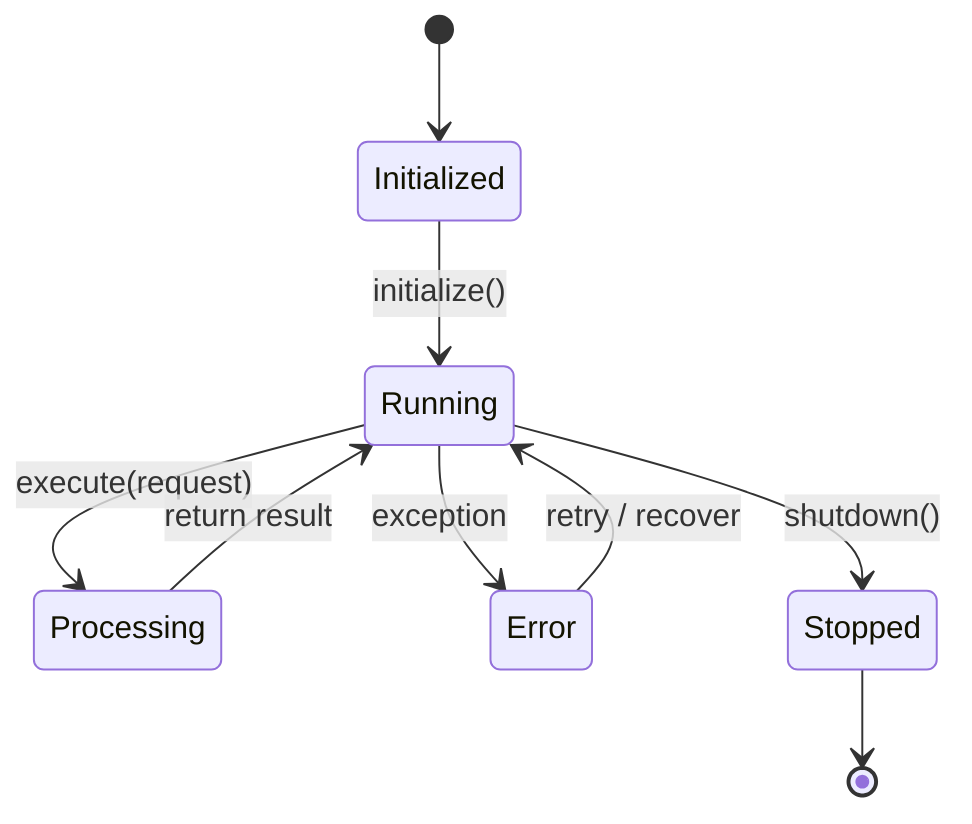
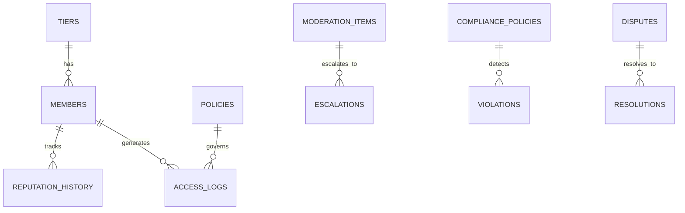
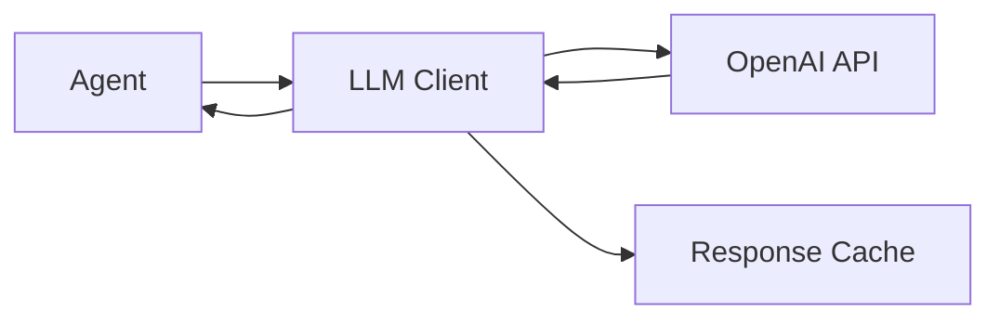
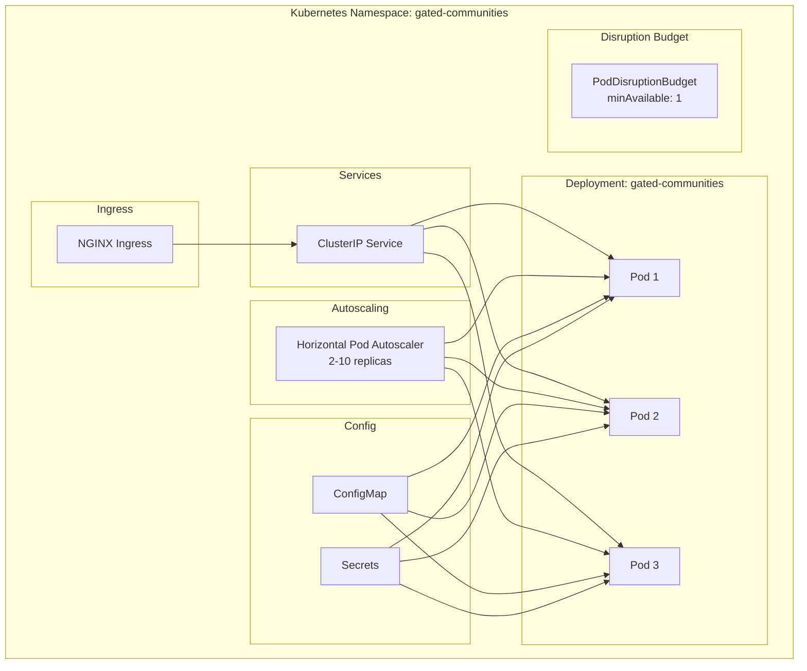
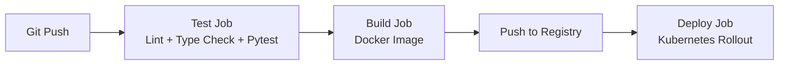

# Architecture

## Gated Communities — System Architecture

---

## Table of Contents

- [System Overview](#system-overview)
- [High-Level Architecture](#high-level-architecture)
- [Data Flow](#data-flow)
- [Module Dependencies](#module-dependencies)
- [Agent Architecture](#agent-architecture)
- [Integration Layer](#integration-layer)
- [Infrastructure](#infrastructure)
- [Security](#security)
- [Scalability](#scalability)

---

## System Overview

Gated Communities is a modular, microservices-inspired platform built as a monolithic FastAPI application. It consolidates 10 independent domain services into a unified system with 57 AI-powered agents.

```mermaid
graph TB
    subgraph "Client Layer"
        Web[Web App<br/>Next.js]
        Mobile[Mobile App]
        Admin[Admin Panel]
        API[API Clients]
    end

    subgraph "API Gateway Layer"
        GW[FastAPI Gateway]
        Auth[Auth Middleware]
        RateLimit[Rate Limiter]
        CORS[CORS Middleware]
    end

    subgraph "Agent Services Layer"
        direction TB
        subgraph "Tier Management"
            TE[Tier Evaluator]
            TA[Tier Analytics]
            TR[Upgrade Recommender]
            BM[Benefit Manager]
            AC[Access Controller]
        end
        subgraph "Moderation Queue"
            AM[Auto Moderator]
            QO[Queue Optimizer]
            HR[Human Review Router]
            PS[Priority Scorer]
            ESC[Escalation]
        end
        subgraph "Access Control"
            PE[Permission Evaluator]
            RM[Role Manager]
            AE[Access Auditor]
            AR[Access Recommender]
            PE2[Policy Enforcer]
        end
        subgraph "Community Health"
            TD[Toxicity Detector]
            EM[Engagement Metrics]
        end
        subgraph "Member Verification"
            IV[Identity Verifier]
            DC[Document Checker]
            FP[Fraud Preventor]
            TS[Trust Scorer]
            EX[Explainer]
        end
        subgraph "Escalation Workflow"
            AR2[Auto Resolver]
            SO[Resolution Optimizer]
            ST[SLA Tracker]
            EA[Escalation Analyzer]
            PR[Priority Router]
        end
        subgraph "Reputation System"
            RS[Reputation Scorer]
            BT[Trust Tier]
            BM2[Badge Manager]
            RH[Reputation History]
            RE[Reputation Explainer]
        end
        subgraph "Compliance Monitor"
            PT[Policy Tracker]
            AR3[Audit Reporter]
            CS[Compliance Scorer]
            VD[Violation Detector]
            REM[Remediation]
        end
        subgraph "Moderation Analytics"
            MP[Moderation Predictor]
            MPerf[Moderator Performance]
            PE3[Policy Effectiveness]
            AE2[Analytics Explainer]
            TA2[Trend Analyzer]
        end
        subgraph "Community Governance"
            DR[Dispute Resolver]
            GA[Governance Analytics]
            RE2[Rule Enforcer]
            PM[Policy Manager]
            GE[Governance Explainer]
        end
    end

    subgraph "Integration Layer"
        LLM[LLM Service<br/>LangChain]
        DB[(PostgreSQL)]
        Cache[(Redis)]
        Notif[Notifications<br/>Slack/Email]
        Ext[External APIs]
        Storage[File Storage]
    end

    subgraph "Infrastructure Layer"
        K8s[Kubernetes]
        CI[CI/CD Pipeline]
        Mon[Monitoring<br/>Prometheus]
        Log[Logging<br/>structlog]
    end

    Web & Mobile & Admin & API --> GW
    GW --> Auth --> RateLimit --> CORS
    CORS --> Agent Services Layer
    Agent Services Layer --> Integration Layer
    Agent Services Layer --> Infrastructure Layer
```

---

## High-Level Architecture

The system follows a layered architecture pattern:

### 1. Client Layer

| Client | Technology | Purpose |
|--------|------------|---------|
| Web App | Next.js 14 + React 18 | Primary user interface |
| Mobile App | React Native | Mobile access |
| Admin Panel | Next.js | Administrative operations |
| API Clients | Any HTTP client | Third-party integrations |

### 2. API Gateway Layer

- **FastAPI** — High-performance async web framework
- **Auth Middleware** — JWT-based authentication
- **Rate Limiter** — Request throttling per client
- **CORS Middleware** — Cross-origin resource sharing

### 3. Agent Services Layer

57 specialized AI agents organized into 10 domain modules. Each agent is a self-contained unit with its own logic, scoring algorithms, and LLM integration.

### 4. Integration Layer

External service integrations providing data persistence, caching, notifications, and LLM capabilities.

### 5. Infrastructure Layer

Kubernetes orchestration, CI/CD pipelines, monitoring, and structured logging.

---

## Data Flow



---

## Module Dependencies



### Dependency Descriptions

| Source | Target | Relationship |
|--------|--------|--------------|
| Tier Management | Access Control | Tier determines access policies |
| Tier Management | Reputation System | Tier affects reputation scoring |
| Moderation Queue | Escalation Workflow | Escalations created from queue items |
| Moderation Queue | Compliance Monitor | Violations tracked for compliance |
| Community Health | Moderation Queue | Health scores trigger moderation |
| Member Verification | Tier Management | Verification unlocks tiers |
| Member Verification | Reputation System | Verification boosts reputation |
| Escalation Workflow | Compliance Monitor | Escalations logged for audit |
| Reputation System | Access Control | Reputation affects access decisions |
| Moderation Analytics | Moderation Queue | Analytics inform queue optimization |
| Moderation Analytics | Compliance Monitor | Analytics track compliance trends |
| Community Governance | Compliance Monitor | Governance policies drive compliance |
| Community Governance | Moderation Queue | Governance rules trigger moderation |

---

## Agent Architecture

Each agent follows a consistent pattern:



### Agent Lifecycle



---

## Integration Layer

### Database (PostgreSQL)



### Cache (Redis)

- Session storage
- Rate limiting counters
- Agent result caching
- Real-time leaderboards

### LLM Integration (LangChain)



### Notifications

- **Slack** — Escalation alerts, queue notifications
- **Email** — Review reminders, compliance reports
- **PagerDuty** — Critical escalation alerts
- **Webhooks** — Custom integrations

---

## Infrastructure

### Kubernetes Architecture



### CI/CD Pipeline



---

## Security

### Authentication & Authorization

- JWT-based authentication
- Role-based access control (RBAC)
- Policy-based access control (PBAC)
- API key management for external clients

### Data Protection

- Secrets stored in Kubernetes Secrets
- TLS termination at ingress
- CORS configuration
- Rate limiting per client
- Input validation via Pydantic

### Audit Logging

- All access decisions logged
- Compliance audit trail (365-day retention)
- Structured logging with structlog
- Prometheus metrics for monitoring

---

## Scalability

### Horizontal Scaling

- **HPA:** 2-10 replicas based on CPU (70%) and memory (80%)
- **PDB:** Minimum 1 pod available during disruptions
- **Stateless design:** All state in PostgreSQL/Redis

### Performance

- **Async I/O:** Full async/await throughout
- **Connection pooling:** Database pool size 20
- **Caching:** Redis for hot data
- **LLM response caching:** Reduces API calls

### Resource Limits

| Resource | Request | Limit |
|----------|---------|-------|
| CPU | 250m | 500m |
| Memory | 256Mi | 512Mi |
