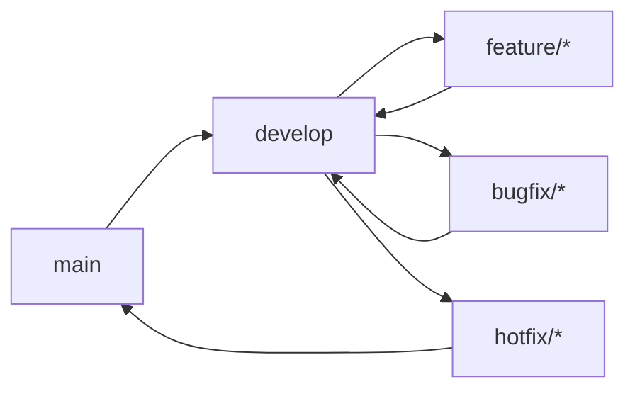

# Development Guide

## Gated Communities — Development Guide

---

## Table of Contents

- [Overview](#overview)
- [Prerequisites](#prerequisites)
- [Project Setup](#project-setup)
- [Development Workflow](#development-workflow)
- [Code Structure](#code-structure)
- [Testing](#testing)
- [Linting and Type Checking](#linting-and-type-checking)
- [Adding a New Agent](#adding-a-new-agent)
- [Adding a New API Endpoint](#adding-a-new-api-endpoint)
- [Configuration](#configuration)
- [Debugging](#debugging)
- [Contributing](#contributing)

---

## Overview

This guide covers everything you need to know to set up a development environment, understand the codebase, and contribute to the project.

---

## Prerequisites

### Required Software

| Software | Version | Installation |
|----------|---------|--------------|
| Python | 3.10+ | [python.org](https://www.python.org/downloads/) |
| Node.js | 18+ | [nodejs.org](https://nodejs.org/) |
| Docker | 24.0+ | [docker.com](https://www.docker.com/) |
| Git | 2.0+ | [git-scm.com](https://git-scm.com/) |

### Recommended Tools

| Tool | Purpose |
|------|---------|
| VS Code | IDE with Python/TypeScript extensions |
| Postman | API testing |
| pgAdmin | PostgreSQL management |
| RedisInsight | Redis management |

---

## Project Setup

### 1. Clone the Repository

```bash
git clone https://github.com/ahmedhassan/gated-communities.git
cd gated-communities
```

### 2. Create Virtual Environment

```bash
# Create virtual environment
python -m venv .venv

# Activate (macOS/Linux)
source .venv/bin/activate

# Activate (Windows)
.venv\Scripts\activate
```

### 3. Install Dependencies

```bash
# Install with dev dependencies
pip install -e ".[dev]"

# Install with test dependencies
pip install -e ".[test]"

# Install all dependencies
pip install -e ".[dev,test]"
```

### 4. Set Up Environment Variables

```bash
# Copy example environment file
cp .env.example .env

# Edit with your values
nano .env
```

### 5. Set Up Database and Cache

```bash
# Using Docker Compose
docker-compose up -d db redis

# Or use local PostgreSQL and Redis
# Make sure they're running and accessible
```

### 6. Run the Application

```bash
# Start the development server
uvicorn gated_communities.main:app --reload

# Or using the CLI
gated-communities
```

### 7. Verify Setup

```bash
# Health check
curl http://localhost:8000/health

# API docs
open http://localhost:8000/docs
```

---

## Development Workflow

### Branching Strategy



### Feature Development

```bash
# Create feature branch
git checkout -b feature/my-feature

# Make changes
# ...

# Run tests
pytest

# Run linter
ruff check src/

# Run type checker
mypy src/

# Commit
git add .
git commit -m "feat: add my feature"

# Push
git push origin feature/my-feature
```

### Commit Message Format

```
<type>: <description>

[optional body]

[optional footer>
```

| Type | Description |
|------|-------------|
| `feat` | New feature |
| `fix` | Bug fix |
| `docs` | Documentation changes |
| `style` | Code style changes |
| `refactor` | Code refactoring |
| `test` | Test changes |
| `chore` | Build/tooling changes |

---

## Code Structure

```
gated-communities/
├── src/gated_communities/
│   ├── agents/                    # AI agents
│   │   ├── access_control/        # Access control agents
│   │   │   ├── base.py           # Base agent class
│   │   │   ├── access_auditor.py
│   │   │   ├── access_recommender.py
│   │   │   ├── permission_evaluator.py
│   │   │   ├── policy_enforcer.py
│   │   │   └── role_manager.py
│   │   ├── community_governance/  # Governance agents
│   │   ├── community_health_scorer/
│   │   ├── compliance_monitor/
│   │   ├── escalation_workflow/
│   │   ├── member_verification/
│   │   ├── moderation_analytics/
│   │   ├── moderation_queue/
│   │   ├── reputation_system/
│   │   └── tier_management/
│   ├── api/                       # FastAPI routes
│   │   ├── routes.py             # Main router
│   │   ├── health.py             # Health endpoints
│   │   ├── tiers.py              # Tier endpoints
│   │   ├── access.py             # Access control endpoints
│   │   ├── metrics.py            # Prometheus metrics
│   │   └── ...
│   ├── integrations/              # External integrations
│   │   ├── database.py           # Database client
│   │   ├── cache.py              # Cache client
│   │   ├── llm.py                # LLM client
│   │   ├── notifications.py      # Notification service
│   │   ├── external.py           # External API integrations
│   │   └── storage.py            # File storage
│   ├── config/                    # Configuration
│   │   ├── settings.py           # App settings
│   │   └── logging_config.py     # Logging config
│   ├── models/                    # Pydantic schemas
│   │   ├── schemas.py            # Tier schemas
│   │   ├── enums.py              # Enumerations
│   │   └── ...
│   ├── exceptions.py              # Custom exceptions
│   └── tests/                     # Test suite
├── frontend/                      # Next.js frontend
│   ├── components/
│   ├── context/
│   ├── lib/
│   └── ...
├── k8s/                           # Kubernetes manifests
├── docker/                        # Docker compose files
├── .github/workflows/             # CI/CD pipeline
├── Dockerfile
├── docker-compose.yml
├── pyproject.toml
└── README.md
```

---

## Testing

### Running Tests

```bash
# Run all tests
pytest

# Run with coverage
pytest --cov=src/gated_communities --cov-report=html

# Run specific test file
pytest src/gated_communities/tests/test_api.py

# Run specific test
pytest src/gated_communities/tests/test_api.py::test_health_check

# Run with verbose output
pytest -v

# Run with async support
pytest --asyncio-mode=auto
```

### Test Structure

```
tests/
├── conftest.py                    # Shared fixtures
├── test_api.py                    # API endpoint tests
├── test_models.py                 # Model validation tests
├── test_config.py                 # Configuration tests
├── test_health.py                 # Health check tests
├── test_agents.py                 # Agent tests
├── test_scores.py                 # Scoring tests
├── test_policies.py               # Policy tests
├── test_violations.py             # Violation tests
├── test_badges.py                 # Badge tests
├── test_trust_tiers.py            # Trust tier tests
├── test_access_evaluation.py      # Access evaluation tests
├── test_explanations.py           # Explanation tests
├── test_audits.py                 # Audit tests
├── test_history.py                # History tests
├── test_remediation.py            # Remediation tests
├── test_reputation.py             # Reputation tests
├── test_roles.py                  # Role tests
├── access_control/                # Access control module tests
├── community_health_scorer/       # Health scorer module tests
├── compliance_monitor/            # Compliance module tests
├── escalation_workflow/           # Escalation module tests
├── member_verification/           # Verification module tests
├── moderation_analytics/          # Analytics module tests
├── moderation_queue/              # Queue module tests
└── reputation_system/             # Reputation module tests
```

### Writing Tests

```python
import pytest
from httpx import AsyncClient
from gated_communities.main import app


@pytest.mark.asyncio
async def test_health_check():
    """Test the health check endpoint."""
    async with AsyncClient(app=app, base_url="http://test") as client:
        response = await client.get("/health")
        assert response.status_code == 200
        data = response.json()
        assert data["status"] == "healthy"
        assert "version" in data


@pytest.mark.asyncio
async def test_create_tier():
    """Test creating a new tier."""
    async with AsyncClient(app=app, base_url="http://test") as client:
        response = await client.post(
            "/api/v1/tiers",
            json={
                "name": "Test Tier",
                "level": "bronze",
                "description": "A test tier",
            },
        )
        assert response.status_code == 201
        data = response.json()
        assert data["name"] == "Test Tier"
        assert data["level"] == "bronze"
```

### Test Fixtures

```python
# conftest.py
import pytest
from httpx import AsyncClient
from gated_communities.main import app


@pytest.fixture
async def client():
    """Create an async test client."""
    async with AsyncClient(app=app, base_url="http://test") as ac:
        yield ac


@pytest.fixture
async def test_tier():
    """Create a test tier and return it."""
    # Create tier logic
    pass
```

---

## Linting and Type Checking

### Ruff (Linter)

```bash
# Check code
ruff check src/

# Check with auto-fix
ruff check src/ --fix

# Check specific file
ruff check src/gated_communities/main.py
```

### MyPy (Type Checker)

```bash
# Type check
mypy src/

# Type check specific file
mypy src/gated_communities/main.py

# Show error codes
mypy src/ --show-error-codes
```

### Pre-commit Hooks

```bash
# Install pre-commit hooks
pre-commit install

# Run manually
pre-commit run --all-files
```

---

## Adding a New Agent

### 1. Create Agent File

```python
# src/gated_communities/agents/my_module/my_agent.py
from __future__ import annotations

from typing import Any

from .base import BaseAgent


class MyAgent(BaseAgent):
    """Agent that performs a specific task."""

    async def initialize(self) -> None:
        """Initialize the agent."""
        self.logger.info("MyAgent initialized")

    async def execute(self, request: dict[str, Any]) -> dict[str, Any]:
        """Execute the agent's main logic.

        Args:
            request: The request data.

        Returns:
            The result of the execution.
        """
        # Implement agent logic here
        result = {
            "status": "success",
            "data": {},
        }
        return result

    async def health_check(self) -> bool:
        """Check if the agent is healthy."""
        return True
```

### 2. Update Module Init

```python
# src/gated_communities/agents/my_module/__init__.py
from .my_agent import MyAgent

__all__ = ["MyAgent"]
```

### 3. Add Tests

```python
# src/gated_communities/tests/my_module/test_my_agent.py
import pytest
from gated_communities.agents.my_module.my_agent import MyAgent


@pytest.mark.asyncio
async def test_my_agent_execute():
    agent = MyAgent()
    await agent.initialize()
    result = await agent.execute({"test": "data"})
    assert result["status"] == "success"
```

---

## Adding a New API Endpoint

### 1. Create Route File

```python
# src/gated_communities/api/my_module.py
from __future__ import annotations

from fastapi import APIRouter, Depends, HTTPException, status

from tier_management.config.settings import Settings, get_settings

my_router = APIRouter()


@my_router.get("/my-endpoint", response_model=dict)
async def my_endpoint(
    settings: Settings = Depends(get_settings),
) -> dict:
    """My endpoint description.

    Args:
        settings: Application settings.

    Returns:
        Response data.
    """
    return {"message": "Hello, World!"}
```

### 2. Register Route

```python
# src/gated_communities/api/routes.py
from .my_module import my_router

api_router.include_router(my_router, prefix="/my-module", tags=["my-module"])
```

### 3. Add Tests

```python
# src/gated_communities/tests/test_my_module.py
import pytest
from httpx import AsyncClient
from gated_communities.main import app


@pytest.mark.asyncio
async def test_my_endpoint():
    async with AsyncClient(app=app, base_url="http://test") as client:
        response = await client.get("/api/v1/my-module/my-endpoint")
        assert response.status_code == 200
        assert response.json()["message"] == "Hello, World!"
```

---

## Configuration

### Settings

All configuration is managed through environment variables with the `TIER_MANAGEMENT_` prefix:

```python
# .env
TIER_MANAGEMENT_LOG_LEVEL=DEBUG
TIER_MANAGEMENT_ENVIRONMENT=development
TIER_MANAGEMENT_DEBUG=true
```

### Adding a New Setting

```python
# src/gated_communities/config/settings.py
class Settings(BaseSettings):
    # ... existing settings ...

    # New setting
    MY_NEW_SETTING: str = "default_value"
    MY_NEW_SETTING_INT: int = 42
    MY_NEW_SETTING_BOOL: bool = True
```

### Logging Configuration

```python
# src/gated_communities/config/logging_config.py
import structlog

def get_logger(name: str):
    """Get a structured logger."""
    return structlog.get_logger(name)
```

---

## Debugging

### VS Code Launch Configuration

```json
{
    "version": "0.2.0",
    "configurations": [
        {
            "name": "Python: FastAPI",
            "type": "python",
            "request": "launch",
            "module": "uvicorn",
            "args": [
                "gated_communities.main:app",
                "--reload",
                "--port", "8000"
            ],
            "jinja": true,
            "justMyCode": false
        }
    ]
}
```

### Debugging with pdb

```python
import pdb; pdb.set_trace()  # Breakpoint
```

### Debugging with logging

```python
from tier_management.config.logging_config import get_logger

logger = get_logger(__name__)

async def my_function():
    logger.debug("Function called", extra_data=data)
    logger.info("Processing complete", result=result)
    logger.error("Something went wrong", error=str(e))
```

---

## Contributing

### Pull Request Process

1. **Fork** the repository
2. **Create** a feature branch (`git checkout -b feature/my-feature`)
3. **Commit** your changes (`git commit -m "feat: add my feature"`)
4. **Push** to the branch (`git push origin feature/my-feature`)
5. **Open** a Pull Request

### PR Checklist

- [ ] Tests pass (`pytest`)
- [ ] Linting passes (`ruff check src/`)
- [ ] Type checking passes (`mypy src/`)
- [ ] Documentation updated
- [ ] Commit messages follow convention
- [ ] No merge conflicts

### Code Review Process

1. PR is opened
2. Automated checks run (CI/CD)
3. Code review by maintainer
4. Approved and merged

### Release Process

1. Update version in `pyproject.toml`
2. Update `CHANGELOG.md`
3. Create git tag (`git tag v1.0.0`)
4. Push tag (`git push origin v1.0.0`)
5. CI/CD builds and deploys
